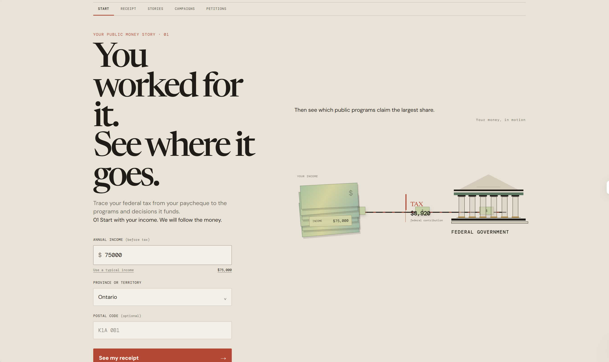
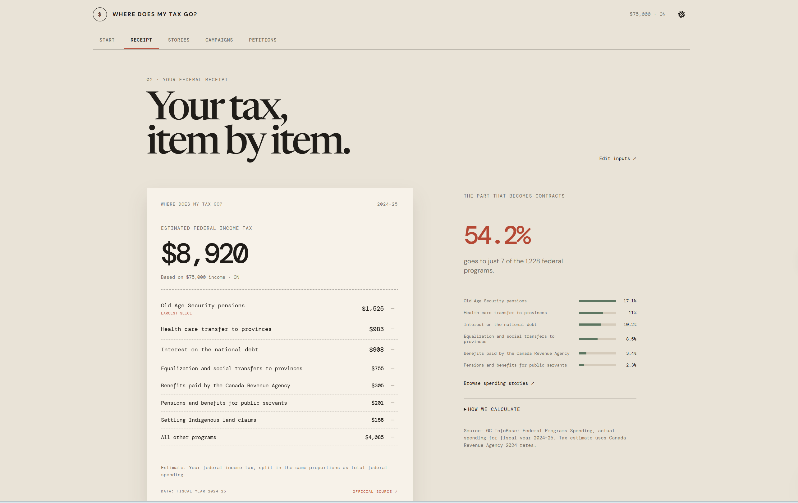
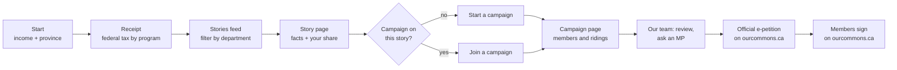
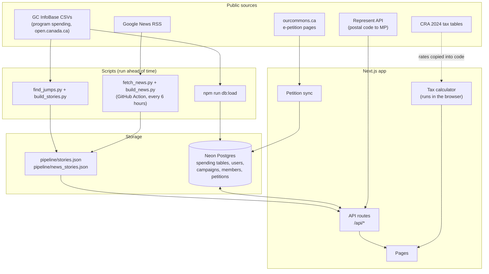
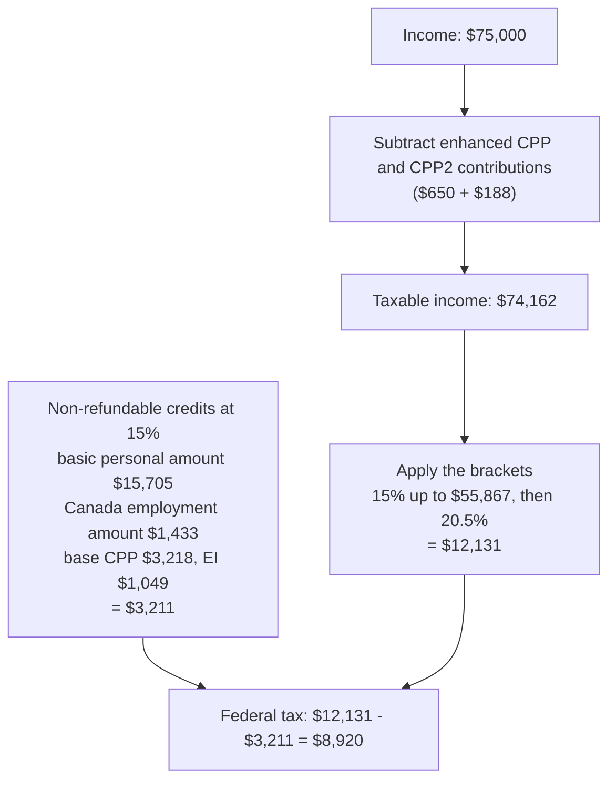
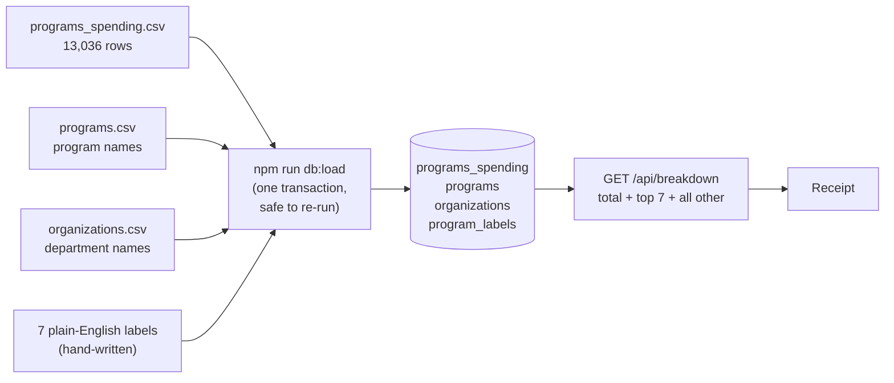
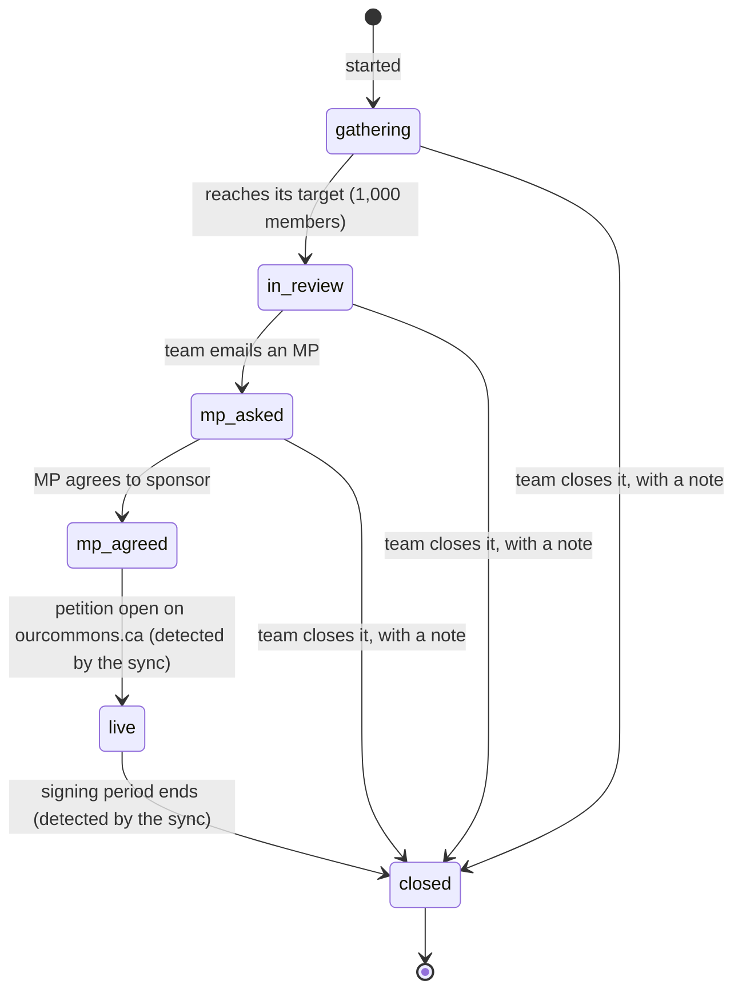
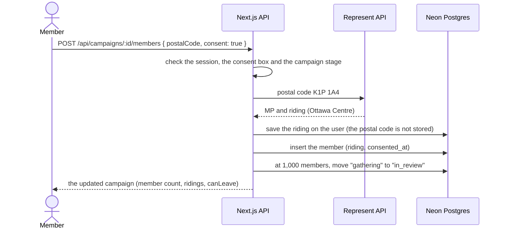
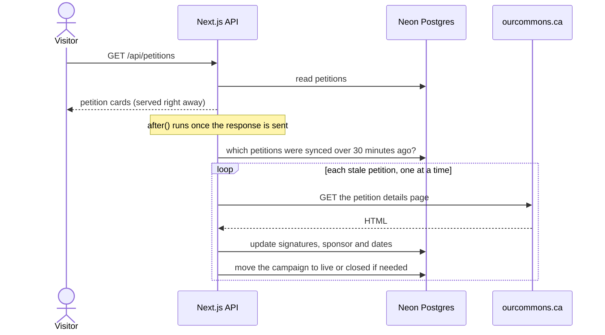
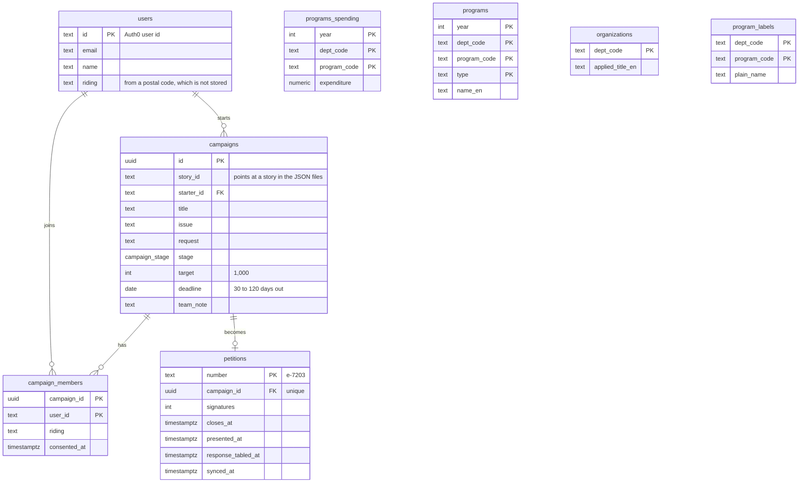

# Where Does My Tax Go?

A web app that turns a Canadian's federal income tax into a personal receipt, shows real federal spending stories with their share of each one, and gives them a way to act on it: start or join a campaign that our team can take to a Member of Parliament and turn into an official House of Commons e-petition.

Built by a team of four at Hack the Hill III (Ottawa, September 2026).





## Contents

1. [The problem](#the-problem)
2. [What the app does](#what-the-app-does)
3. [Architecture](#architecture)
4. [The tax calculator](#the-tax-calculator)
5. [The spending data](#the-spending-data)
6. [Campaigns and official petitions](#campaigns-and-official-petitions)
7. [Database](#database)
8. [API](#api)
9. [Privacy and trust rules](#privacy-and-trust-rules)
10. [Design decisions and trade-offs](#design-decisions-and-trade-offs)
11. [Tech stack](#tech-stack)
12. [Running it locally](#running-it-locally)
13. [Testing](#testing)
14. [Project structure](#project-structure)
15. [Team](#team)
16. [Limits and next steps](#limits-and-next-steps)

## The problem

Canadians hear about federal spending in two ways, and neither helps much:

- **News headlines** cover one story at a time, with no sense of scale. People get angry for a week and move on, because there is nothing obvious to do.
- **Budget documents and dashboards** cover everything, in numbers most people can't use, and offer no way to act.

Neither one shows a person what *their* money paid for, and neither turns "that seems off" into something a decision maker has to answer.

## What the app does

| Step | Screen | What the user sees |
|---|---|---|
| 1 | Start | Enters income and province. The tax estimate runs in the browser. |
| 2 | Receipt | Their federal tax ($8,920 on $75,000 in Ontario), split across the 7 biggest federal programs plus "All other programs", with a "How we calculate" panel. |
| 3 | Stories | A feed of real spending stories (programs whose spending jumped, plus federal spending news), filterable by department. |
| 4 | Story | One story: the facts, "your share" of it, sources, and its campaigns. |
| 5 | Campaigns | Start a campaign on a story, or join one. Joining records the member's riding and consent. |
| 6 | Petitions | Campaigns our team turned into official e-petitions, with live signature counts from ourcommons.ca. |
| Admin | /admin | Our team reviews campaigns, emails an MP, attaches the official petition number, and moves campaigns through their stages. |



## Architecture

The app is one Next.js project. Data that changes rarely is prepared ahead of time by scripts. Data that users create lives in a Postgres database (Neon).



Two rules shaped this layout:

- **Income never leaves the device.** The tax calculator is plain TypeScript with the 2024 rates written into it, so the browser does the whole calculation. No request ever contains the user's income.
- **Stories are files, not database rows.** The story pipelines commit JSON files to the repo. A new commit triggers a new deploy, and the API reads the files. This kept the database for data that users create.

## The tax calculator

`src/shared/tax.ts` estimates 2024 federal and provincial income tax for an employee in any of the 13 provinces and territories:

```ts
estimateTax(75_000, "ON")
// { federal: 8920, provincial: 4585, total: 13505, effectiveRate: 0.18 }
```

How a federal amount is worked out, with $75,000 in Ontario:



What it covers:

- Federal brackets, the basic personal amount (including its phase-out for high incomes) and the Canada employment amount.
- CPP, CPP2 and EI, split the way the tax return treats them: the base part is a credit, the enhanced parts are deductions.
- Every province's and territory's brackets and basic personal amount, plus the special cases: Ontario's surtax, health premium and low-income reduction, BC's low-income reduction, Nova Scotia's sliding basic personal amount, Yukon's employment amount, and Quebec's QPP, QPIP, lower EI rate and 16.5% federal abatement.

**How it was checked.** Online 2024 calculators are gone, so the results were compared with the CRA's own 2024 payroll tax tables (T4032) for Ontario, BC, Alberta, Nova Scotia and Quebec. Below $68,500 they match within $3 a year. Above that, ours is lower by exactly $188 times the marginal rate: $188 is the CPP2 contribution, which the payroll tables leave out but the tax return deducts. Those comparisons are unit tests (`src/shared/tax.test.ts`). Every rate is sourced in [VERIFIED_SOURCES.md](VERIFIED_SOURCES.md).

## The spending data

The receipt and the "your share" numbers come from GC InfoBase, the Treasury Board's open data on actual spending by program.



- **Total federal spending for 2024-25: $472.5 billion** across 1,228 programs. Every screen uses this one number.
- **Your share** of anything = your federal tax x (its cost / total federal spending). On $75,000 in Ontario, Old Age Security ($80.8 billion) works out to about $1,525.
- **What the dataset leaves out.** The government's official total expenses were $547.3 billion. The gap is mostly the Canada Child Benefit ($28.6 billion) and Employment Insurance benefits ($24.9 billion), which are not in the program data. The "How we calculate" panel says so, and the figures and their sources are in [VERIFIED_SOURCES.md](VERIFIED_SOURCES.md).

**Stories** come from two pipelines:

| Source | How | Example |
|---|---|---|
| Spending jumps | `find_jumps.py` compares each program's spending between years and picks large changes; `build_stories.py` writes them as stories, checked by hand. | "Interest on the federal debt rose 52% in two years" |
| News | A GitHub Action runs every 6 hours: `fetch_news.py` reads Google News RSS, `build_news.py` uses Gemini to pull out the amount, department and a neutral summary, and drops provincial items. | Federal funding announcements and contracts |

There are 18 data stories and 70 news stories across 30 departments at the time of writing.

## Campaigns and official petitions

Our app does not submit petitions itself. It builds support, and the official petition lives on ourcommons.ca:

1. Someone reads a story and **starts a campaign** (a title, an issue starting with "Whereas", and a requested action). They are its first member. One campaign per person per story.
2. Others **join**. Joining needs a riding (found once from a postal code) and consent to share their name, email and riding with the MP who is asked to sponsor it.
3. At **1,000 members** (twice the 500 signatures ourcommons.ca needs, since about half of members are expected to sign officially) the campaign moves to review.
4. **Our team** emails an MP, creates the e-petition on ourcommons.ca by hand once the MP agrees, and attaches its number in the admin page.
5. The app reads the petition's public page on ourcommons.ca and shows **live signatures, the closing date, and later the date it was presented and the government's response**.



Members can join from "gathering" up to "MP agreed". Once a campaign is live, the join button becomes "Sign on ourcommons.ca".

**Joining a campaign:**



**Keeping petition numbers fresh.** ourcommons.ca has no petition API, so `src/lib/petitions/ourcommons.ts` reads the public details page: the signature count, the sponsor MP, and the History dates. It was built and tested against real petition pages. Instead of a scheduled job, the app refreshes petitions that are more than 30 minutes old whenever someone views them, after the response has been sent:



`npm run petitions:sync` and the admin "refresh" button run the same sync on demand.

## Database

Neon Postgres, accessed with Drizzle ORM. The schema is in `src/db/schema.ts`, and every change ships as a SQL migration in `drizzle/`.



Rules the database enforces itself, not just the code:

- **One campaign per person per story:** a unique constraint on `(story_id, starter_id)`.
- **One membership per person per campaign:** the primary key of `campaign_members`.
- **One official petition per campaign, and a petition number used only once:** `petitions.number` is the primary key and `campaign_id` is unique.

## API

All routes are in `src/app/api`. JSON in and out; errors are `{ "error": "<code>" }`. The full reference, with every request, response and error code, is in [docs/campaigns-api.md](docs/campaigns-api.md).

| Area | Routes |
|---|---|
| Spending | `GET /api/breakdown` (total and top 7 programs), `GET /api/spending?department=` (story feed), `GET /api/spending/:id`, `GET /api/departments` (filter chips) |
| Campaigns | `GET/POST /api/campaigns`, `GET/PATCH /api/campaigns/:id`, `POST/DELETE /api/campaigns/:id/members` |
| Petitions | `GET /api/petitions`, `GET /api/petitions/:id` |
| Account | `GET /api/me` (saved riding, admin flag), `PUT /api/me/riding` |
| MP lookup | `GET /api/mp?postal=`, `GET /api/mps` |
| Admin | `GET /api/admin/campaigns`, `PATCH /api/admin/campaigns/:id`, `GET /api/admin/campaigns/:id/members`, `PUT /api/admin/campaigns/:id/petition`, `POST /api/admin/petitions/sync` |

Admin routes check `ADMIN_EMAILS` on the server and answer 404 to everyone else, so the admin area is not visible from outside.

## Privacy and trust rules

| Rule | How it is enforced |
|---|---|
| Income never leaves the device | The tax calculation runs in the browser; no API takes income as input. |
| Postal codes are not stored | The API turns a postal code into a riding through the Represent API and saves only the riding. A test checks that no postal code reaches the database. |
| Sharing needs consent | Joining requires `consent: true`. Only members who consented are in the list our team sends to an MP. |
| Members are shown by first name only | Public lists show the starter's first name, or "Someone" if the account name is an email address. |
| Every number has a source | Spending figures link to GC InfoBase; tax rates and the checks against CRA tables are in [VERIFIED_SOURCES.md](VERIFIED_SOURCES.md). |
| Petition rules are checked before submission | Title up to 250 characters, issue starts with "Whereas", the whole text up to 250 words, no links. The form and the API use the same check (`src/lib/campaigns/rules.ts`). |

## Design decisions and trade-offs

| Decision | Why | Trade-off |
|---|---|---|
| Tax calculated in the browser | Income is sensitive, and the calculation needs no data from the server. | The rates live in the code and must be updated each tax year. |
| Spending data in Postgres, stories in JSON files | Spending data is queried (totals, top programs, joins with names). Stories are produced by scripts and change only when a pipeline runs, so a committed file plus a redeploy is enough. | New stories appear on the next deploy, not instantly. |
| Our own total ($472.5 billion) rather than the official $547.3 billion | Every "your share" must come from the same dataset as the items being compared. | The receipt leaves out the Canada Child Benefit and EI; the app says so. |
| Read ourcommons.ca pages instead of an API | ourcommons.ca publishes no petition API. | If the page layout changes, the parser must change. A trimmed real page is kept as a test fixture so a break shows up in the tests. |
| Refresh petitions on view with `after()` | Counts stay current without running a scheduler; users never wait for ourcommons.ca. | A petition nobody views is not refreshed; `npm run petitions:sync` covers that. |
| Rules enforced in the database | Uniqueness holds even with two requests at the same moment. | Schema changes need a migration on every database. |
| 1,000-member target | About half of supporters are expected to sign officially, and an e-petition needs 500 signatures for a government response. | A rule of thumb, not measured. |

## Tech stack

| Layer | Tools |
|---|---|
| App | Next.js 16 (App Router, route handlers), React 19, TypeScript, Tailwind CSS 4 |
| Database | Neon Postgres, Drizzle ORM and drizzle-kit migrations, the `postgres` driver |
| Auth | Auth0 (`@auth0/nextjs-auth0`) |
| Validation | zod |
| Tests | Vitest, PGlite (Postgres compiled to WebAssembly, so database tests run with no server) |
| Data pipelines | Python (pandas) for stories and news, Gemini for news extraction and images, tsx scripts for loading the database |
| Automation | GitHub Actions (news refresh every 6 hours) |
| External services | Represent API by Open North (postal code to MP), ourcommons.ca (petitions) |

## Running it locally

Requirements: Node 22, npm, and Python 3.11 for the story pipelines.

```bash
npm install
npm run dev
```

Open http://localhost:3000. Without Auth0 settings, development mode logs you in as a local test user, who is also an admin.

To use a real database, put these in `.env.local` (never committed):

| Variable | Used for |
|---|---|
| `DATABASE_URL` | Neon Postgres connection string |
| `AUTH0_DOMAIN`, `AUTH0_CLIENT_ID`, `AUTH0_CLIENT_SECRET`, `AUTH0_SECRET`, `APP_BASE_URL` | Login |
| `ADMIN_EMAILS` | Comma-separated login emails of the team |
| `TEAM_GMAIL` | The account the team sends MP and "sign now" emails from |
| `GEMINI_API_KEY` | News extraction and story images (pipelines only) |

Then set up the database:

```bash
npm run db:migrate   # create or update the tables
npm run db:load      # load the GC InfoBase spending data (CSVs in pipeline/data/, links in VERIFIED_SOURCES.md)
npm run db:seed      # optional: demo campaigns
```

| Script | Does |
|---|---|
| `npm run dev` | Development server |
| `npm run build` / `npm start` | Production build and server |
| `npm test` | All unit and API tests |
| `npm run lint` | ESLint |
| `npm run db:generate` | Write a new migration after editing `src/db/schema.ts` |
| `npm run db:migrate` | Apply migrations that have not run yet |
| `npm run db:load` | Reload the spending tables from the CSVs |
| `npm run db:seed` | Load demo campaigns |
| `npm run petitions:sync` | Refresh every official petition from ourcommons.ca |

## Testing

```bash
npm test
```

About 200 tests in 31 files. Database tests run against PGlite with the real migrations applied, so they exercise the same SQL as production without a database server. Highlights:

- **Tax:** 19 cases compared with the CRA's official 2024 tables, plus edge cases (zero income, unknown province, tax never decreasing as income rises).
- **Spending:** loading sample CSVs twice without duplicates, the totals and top programs, the API's 200, 400 and 404 answers.
- **Campaigns:** starting, the one-per-story rule, joining with and without a saved riding, consent, the edit lock once someone else joins, leaving, list ordering, the admin 404 for everyone else, attaching a petition and seeing the campaign go live.
- **Petitions:** parsing a real ourcommons.ca page, Ottawa time zones, a petition that does not exist yet, and the site being unreachable.

## Project structure

```text
src/
  app/
    (tracker)/          start, receipt, spending feed and story pages
    campaigns/          campaign list, start, edit and campaign pages
    petitions/          official petitions page
    admin/              team pages: campaign list and campaign detail
    api/                route handlers (see API)
  components/           shared screens and hooks (useBreakdown, useSpending)
  db/                   Drizzle schema and connection
  lib/
    campaigns/          rules, campaigns, admin actions, MP and member emails
    petitions/          ourcommons.ca parser and petition sync
    mp/                 Represent API lookup
    breakdown.ts        spending breakdown query
    spendingData.ts     CSV loader for the spending tables
    stories.ts          reads the story JSON files
  shared/               code used in the browser: tax calculator, breakdown types, "How we calculate"
drizzle/                SQL migrations
pipeline/               data and story scripts, story JSON files
docs/                   API reference and design notes
VERIFIED_SOURCES.md     every number and where it comes from
TASKS.md                task breakdown and team decisions
```

## Team

| Person | Area |
|---|---|
| Raphael | Data: tax calculator, spending breakdown and database, spending and campaign APIs, official petitions and the ourcommons.ca sync |
| Izu | UI: the screens and the visual design |
| Great | Stories: data stories from spending jumps, the news pipeline, campaigns on stories |
| Muktar | Platform: Auth0 login, MP lookup, admin pages, deploy |

## Limits and next steps

- **Tax estimate:** employment income only. Other income, RRSP deductions and less common credits are not modelled.
- **Dataset gap:** the Canada Child Benefit and EI are not in the GC InfoBase program data, so the receipt covers $472.5 billion of $547.3 billion.
- **Emails are sent by hand.** Telling members about stage changes, or that a petition is open to sign, could move to an email service.
- **Petition parser:** depends on the layout of ourcommons.ca pages; a public petition API would replace it.
- **Provincial spending:** e-petitions only cover federal matters, so provincial items are out of scope for campaigns.
